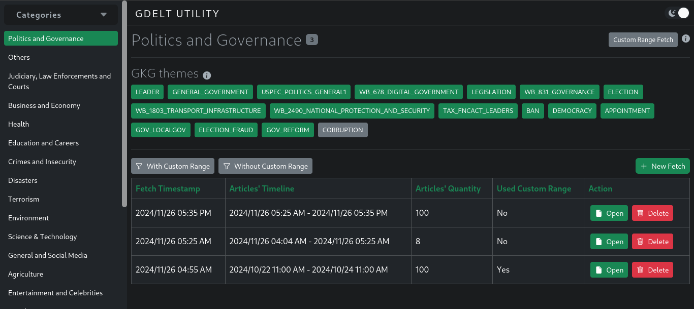
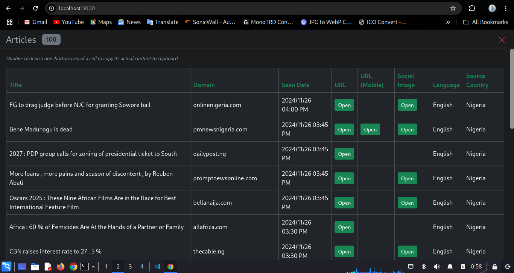

# 234EDGER GDELT UTILITY

## Get Current Global News and Articles, Categorized and Streamlined for Easy Access



This project is a web-based application that serves as a utility for generating queries to fetch articles from **[GDELT 2.0](https://blog.gdeltproject.org/gdelt-doc-2-0-api-debuts/)** and as a repository for classifying, accessing, displaying and managing the fetched articles.

Users can search and store articles or news on specific **[GKG (Global Knowledge Graph) Themes](http://data.gdeltproject.org/api/v2/guides/LOOKUP-GKGTHEMES.TXT)**, categories (groups of related GKG themes under a single label), within specific countries or globally, and for selected timelines.

For instance, a query might retrieve articles in the **Business and Economy** category (themes like EPU_ECONOMY, ECON_TAXATION, and ECON_INFLATION) published in Nigeria, in English, between **2024/10/22 at 12 PM** and **2024/11/20 at 11 AM**. The application not only fetches these results but also organizes them into a well-structured repository for easy tracking and future reference.

---

## How It Works  

This application allows users to classify **[GKG Themes](http://data.gdeltproject.org/api/v2/guides/LOOKUP-GKGTHEMES.TXT)** into categories using the  **[categories.json](./categories.json)** file and specify additional query parameters, such as source countries, languages, formats, and sorting, in the **[\.env](./.env)** file.  

Once configured, the application can be run, and the web app can be accessed in a browser. From the web app, users can:  
- Set timelines for queries.  
- Make **[GDELT 2.0](https://blog.gdeltproject.org/gdelt-doc-2-0-api-debuts/)** requests.  
- View, access, and manage the resulting articles directly from the interface.  

This setup streamlines the process of fetching and organizing global news articles for further exploration and management.

---

## Motivation - Why It Was Made  

While working on **[234Ledger.com.ng](https://234ledger.com.ng)**, a news aggregator website for Nigerian audiences, the admin needed a simple way to source and track news and trends across various topics and categories without manually navigating multiple websites and blogs.  

Several APIs, such as Newsdata.io, Mediastack.com, and NewsAPI.ai, were considered, but these were either limited in their free versions or required paid subscriptions. The **[GDELT 2.0 API](https://blog.gdeltproject.org/gdelt-doc-2-0-api-debuts/)** emerged as the ideal choice due to its free access and extensive coverage, but its implementation required significant technical expertise.  

This utility was developed to simplify access to GDELT, providing an easy-to-use tool for sourcing and organizing up-to-date news and articles. While designed with Nigeria in mind, the tool is highly flexible and customizable, making it suitable for anyone looking to track news and trends on any topic, anywhere in the world.

---

## Use Cases  

This utility can be adapted to a variety of scenarios, making it an invaluable tool for individuals, organizations, and businesses looking to stay informed and organized:  

- News Bloggers:  
  - Use the tool to keep track of up-to-date news and articles, simplifying the process of sourcing content for blogs and websites.  

- News Aggregators:  
  - Platforms like **[234Ledger.com.ng](https://234ledger.com.ng)** can leverage this utility to streamline content sourcing, ensuring diverse and timely news coverage.  

- Organizations and Institutions:  
  - Businesses can monitor industry news, market trends, or competitor updates within specific regions or sectors.  
  - Non-profits can track global events related to their causes, such as climate change or humanitarian crises.  

- Law Enforcement and Security Agencies:  
  - Track news and reports related to security incidents, crime patterns, or ongoing investigations in specific areas.  

- Academics and Researchers:  
  - Gather news articles for data analysis, trend tracking, or case studies in various fields like politics, economics, or media studies.  

- Individuals:  
  - Stay updated on topics of personal interest, such as technology, sports, or entertainment, by organizing news from reliable sources.  

- Custom Applications:  
  - The utility’s flexibility allows it to be tailored for niche applications, such as monitoring regional news in remote areas or tracking specialized themes like environmental disasters or economic policies.  

The possibilities are endless, making this tool a versatile solution for accessing and managing global news and trends across various use cases.

---

## Installation  

This project is designed to run locally and does not include server-side validation or user authentication for its UI. If you wish to deploy it on a publicly accessible server, you can set it up behind a proxy with authentication or contact me (details in the **Support** section) for customization.  

### System Requirements  
- Node.js: Version 20.17.0 or compatible.  
- NPM: Version 9.2.0 or compatible.  
- A web browser and a code editor (for optional customization).  

### Installation Steps  

1. **Clone the Repository:**  
   Clone or download this repository to your local machine.  

2. **Install Dependencies:**  
   Open a terminal in the project root folder and run:  
   ```bash
   npm install
   ```

3. **Customize Environment Variables:**  
    Edit the .env file in the project root to configure the application settings. Instructions are included within the file.

4. **Define Categories (Optional):** 
    - Edit the categories.json file to organize GKG themes into categories.
    - Ensure the file adheres to the following structure:

    ```typescript
    class Category {
        name!: string; // Unique name for the category
        id!: number;   // Unique integer identifier
        themes!: string[]; // Array of GKG themes for the category
    }[]
    ```
    - Refer to the **[GKG Themes](http://data.gdeltproject.org/api/v2/guides/LOOKUP-GKGTHEMES.TXT)** page for the full list of themes.

5. **Start the Application:**  
    Run the following command in the project root directory:
    ```bash
    npm start
    ```
    Open the link printed in the terminal in your web browser to access the UI.

6. **UI Instructions:**  
    The UI is intuitive and includes instructions for usage.

7. **Translate the UI (Optional):**  
    To translate the interface, edit the values in **[interface/i18n/default.json](./interface/i18n/default.json)** with your preferred language and reload the browser tab.

---

## Technical Details  

### Tools Used  
- **UI/Front-End:** Built with Angular 18.2.8, Bootstrap 5.3.3, and @ngx-translate/core 16.0.3.  
- **Server:** Powered by Express 4.18.2 and TypeScript 5.3.3.  
- **Communication:** 
  - Between UI and Server: Socket.io (socket.io 4.7.5 and ngx-socketio2-updated 18.1.0).  
  - Between Server and GDELT: Axios 1.7.2.  
- **Persistence:** Utilizes Debbiebase 1.0.0, a lightweight file-system-based JSON database I developed for private projects.  

### Notable Features  
- The UI includes a one-click toggle for light and dark modes, enhancing user convenience.  

---

## Roadmap  

This project continues to evolve based on [234Ledger.com.ng](https://234ledger.com.ng) admin’s requirements. Future plans include:  

1. AI-Powered Super Highway:  
   - A feature to extract, summarize, categorize, and upload article content directly to [234Ledger.com.ng](https://234ledger.com.ng).  
   - Ensures no duplicate articles, news, or stories are uploaded.  

2. Automation:  
   - Fully automating the Super Highway for seamless operation.  

---

## Support  

For support, collaboration, or inquiries about development, programming, maintenance, or optimization services, feel free to contact me:  
- Email: [gbiangb@gmail.com](mailto:gbiangb@gmail.com)  
- Website: [jtorque.online](https://jtorque.online)  

I’m an all-round tech enthusiast and open to various opportunities!  

---

## License  

This project is free to use without limitations, in line with GDELT's free usage policy.

---

## Additional Screenshots

Articles view - table with pagination


---